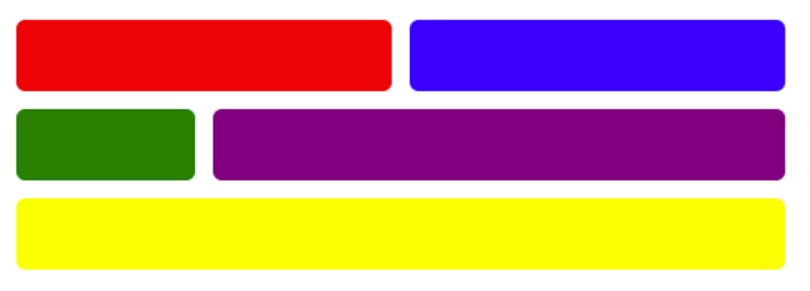
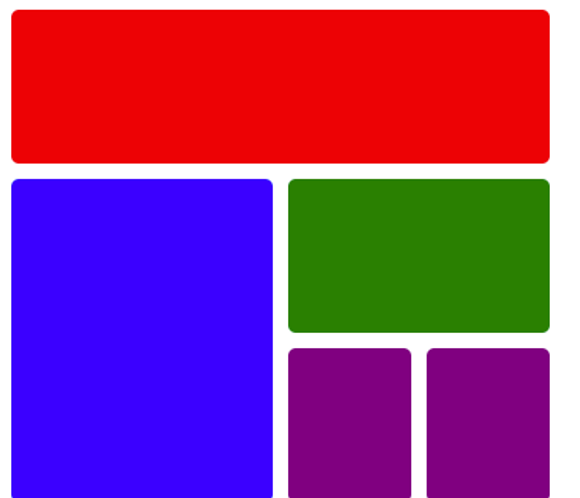
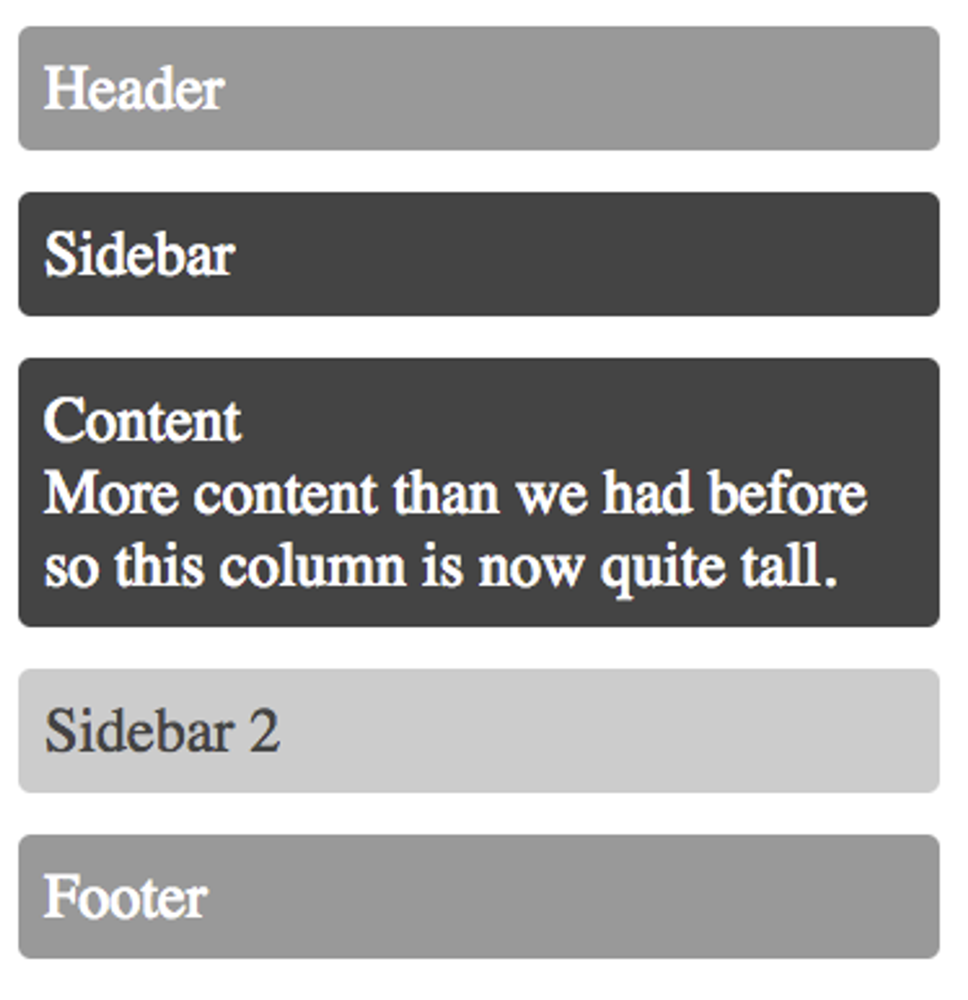
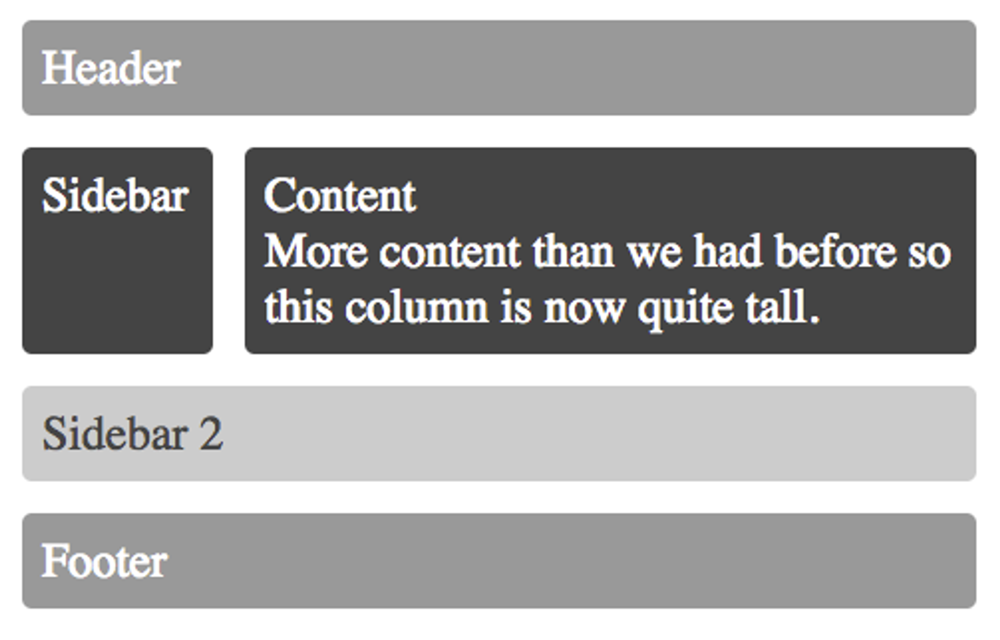
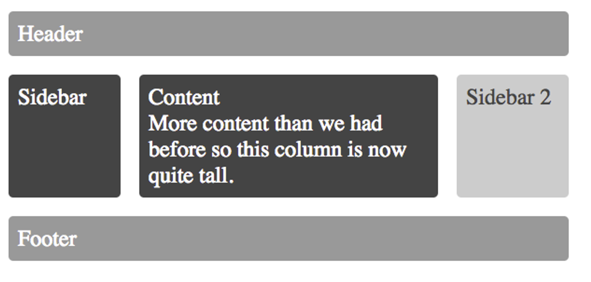

Remake these images using CSS Grid. Feel free to use more pleasant colors.

### **1.**

> Hint: Think ahead about the "smallest common denominator" in terms of how many columns you might want to set up your grid to have.
> 

---

### **2.**

> See the hint from #1
> 

---

### **3. Responsive Layouts**

The next three use the same HTML and CSS files. Same pieces of content, but will display different on different devices.

Use media queries to make your layout similar to the images below:

---

Phone:

---

Tablet:

---

Laptop:

# Next Up

[Business Time Project](https://www.notion.so/Business-Time-Project-93ba13f59b204cbbbb99edccedfdd2bc?pvs=21)